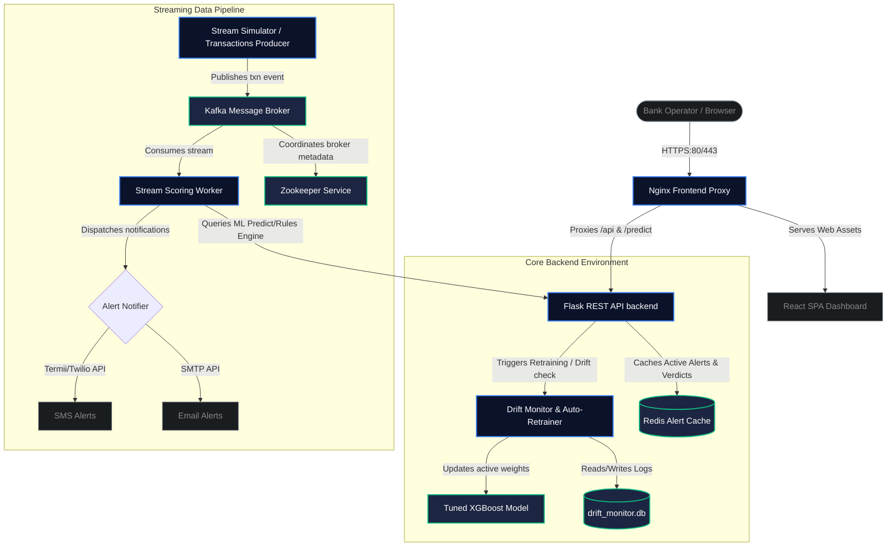

# NairaShield Production Deployment Guide 🇳🇬🛡️
### Production-Grade Containerized Deployment Manual

This guide details the steps to deploy the containerized NairaShield Transaction Monitoring & Fraud Detection system on a Linux Virtual Private Server (VPS) such as a DigitalOcean Droplet, AWS EC2 instance, or Google Cloud VM.

---

## 🗺️ 1. System Architecture

Below is the high-level architecture of NairaShield's components when running under Docker Compose:



---

## 📋 2. Prerequisites & Resource Allocation

Ensure your target Linux host satisfies the following requirements:

*   **Operating System**: Ubuntu 22.04 LTS or Ubuntu 24.04 LTS (Recommended).
*   **Hardware Specifications**:
    *   **Minimum**: 2 vCPUs, 4 GB RAM, 20 GB SSD.
    *   **Recommended**: 4 vCPUs, 8 GB RAM, 50 GB SSD (required for optimal memory when Zookeeper, Kafka, Redis, and ML retraining run concurrently).
*   **Domain Name**: A registered domain (e.g., `nairashield.yourbank.com.ng`) pointed via A-record to the server's public IP address.
*   **Outbound Communication Ports**: Ports `25/587` (SMTP mailing) and `80/443` (HTTP/HTTPS) must be allowed out.

---

## 🔒 3. Server Initialization & Security Hardening

Connect to your VPS host:
```bash
ssh username@your-server-ip
```

### System Update & Upgrade
```bash
sudo apt-get update && sudo apt-get upgrade -y
```

### Configure Uncomplicated Firewall (UFW)
Secure your host by blocking direct external access to databases or message queues, ensuring only web portal traffic and SSH can reach the machine:

```bash
# Set default policies
sudo ufw default deny incoming
sudo ufw default allow outgoing

# Allow standard SSH and Web traffic
sudo ufw allow ssh
sudo ufw allow 80/tcp
sudo ufw allow 443/tcp

# Enable firewall
sudo ufw enable
```

Confirm the firewall rules:
```bash
sudo ufw status verbose
```
*Note: Direct access to Redis (`6379`), Kafka (`9092`), and Flask API (`5000`) will remain secure inside the Docker bridge network.*

---

## 📦 4. Docker Engine & Docker Compose Setup

Install the latest version of Docker and Docker Compose:

```bash
# Add Docker's official GPG key
sudo apt-get update
sudo apt-get install ca-certificates curl gnupg -y
sudo install -m 0755 -d /etc/apt/keyrings
curl -fsSL https://download.docker.com/linux/ubuntu/gpg | sudo gpg --dearmor -o /etc/apt/keyrings/docker.gpg
sudo chmod a+r /etc/apt/keyrings/docker.gpg

# Add the repository to Apt sources
echo \
  "deb [arch=$(dpkg --print-architecture) signed-by=/etc/apt/keyrings/docker.gpg] https://download.docker.com/linux/ubuntu \
  $(. /etc/os-release && echo "$VERSION_CODENAME") stable" | \
  sudo tee /etc/apt/sources.list.d/docker.list > /dev/null

sudo apt-get update

# Install Docker packages
sudo apt-get install docker-ce docker-ce-cli containerd.io docker-buildx-plugin docker-compose-plugin -y
```

*(Optional)* Run Docker commands without typing `sudo`:
```bash
sudo usermod -aG docker $USER
newgrp docker
```

---

## 📝 5. Application Configuration (`.env`)

Clone the repository or upload your files into the target folder `~/nairashield`.

1. Create a production configuration file from the template:
   ```bash
   cp .env.example .env
   nano .env
   ```

2. Configure the deployment parameters inside the `.env` file:

```ini
# ============================================================
# NairaShield Production Configuration Variables
# ============================================================

# ---- SMTP Email Settings ----
# Secure Gmail or Corporate SMTP relay configuration
SMTP_HOST=smtp.gmail.com
SMTP_PORT=587
SMTP_USER=alerts@yourbank.com
SMTP_PASS=your-secure-smtp-password
ALERT_FROM_EMAIL=nairashield-alerts@yourbank.com
ALERT_TO_EMAILS=fraud-team@yourbank.com,compliance-officer@yourbank.com

# ---- SMS Provider Settings: Termii (Recommended for Nigerian Networks) ----
SMS_PROVIDER=termii
TERMII_API_KEY=t_key_xxxxxxxxxxxxxxxxxxxxxxxxxxx
TERMII_SENDER_ID=NairaShield
TERMII_RECIPIENTS=+2348030000000,+2348120000000

# ---- SMS Provider Settings: Twilio (Alternative) ----
TWILIO_ACCOUNT_SID=ACxxxxxxxxxxxxxxxxxxxxxxxxxxxxx
TWILIO_AUTH_TOKEN=your_auth_token_here
TWILIO_FROM_NUMBER=+14155551234
TWILIO_TO_NUMBERS=+2348030000000

# ---- Security & Alerting Threshold ----
# Set minimum classification confidence score to trigger active notifications
ALERT_CONFIDENCE_THRESHOLD=0.85

# ---- Redis & Kafka Hosts ----
REDIS_HOST=redis
REDIS_PORT=6379
KAFKA_BOOTSTRAP_SERVERS=kafka:9092
STREAM_CONTINUOUS=true

# ---- Port Configuration ----
# Ports exposed to Nginx or system host
PORT_API=5000
PORT_FRONTEND=8080
```

---

## 🛡️ 6. SSL/TLS Certificate Setup (Nginx Reverse Proxy)

To secure user login credentials and transaction payloads in transit, set up SSL using Nginx and Certbot.

### Step 1: Install Nginx & Certbot on the Host
```bash
sudo apt-get install nginx certbot python3-certbot-nginx -y
```

### Step 2: Configure Host Nginx Config
Create an Nginx configuration file for your domain (`/etc/nginx/sites-available/nairashield`):

```nginx
server {
    listen 80;
    server_name nairashield.yourbank.com.ng;

    location / {
        proxy_pass http://127.0.0.1:8080; # Route requests to React Frontend Container
        proxy_set_header Host $host;
        proxy_set_header X-Real-IP $remote_addr;
        proxy_set_header X-Forwarded-For $proxy_add_x_forwarded_for;
        proxy_set_header X-Forwarded-Proto $scheme;
    }

    location /api/ {
        proxy_pass http://127.0.0.1:5000/api/; # Route REST auth requests to Flask API
        proxy_set_header Host $host;
        proxy_set_header X-Real-IP $remote_addr;
    }

    location /predict {
        proxy_pass http://127.0.0.1:5000/predict; # Route inference payloads to Flask API
        proxy_set_header Host $host;
        proxy_set_header X-Real-IP $remote_addr;
    }
}
```

### Step 3: Enable the Configuration & Obtain Certificate
```bash
# Link config to sites-enabled
sudo ln -s /etc/nginx/sites-available/nairashield /etc/nginx/sites-enabled/
sudo rm /etc/nginx/sites-enabled/default

# Test config and reload nginx
sudo nginx -t
sudo systemctl reload nginx

# Run Certbot to acquire SSL and auto-modify Nginx for HTTPS redirect
sudo certbot --nginx -d nairashield.yourbank.com.ng
```

---

## 🚀 7. Running the Container Stack

Deploy the entire microservice architecture:

```bash
# Build images and start containers in detached mode
docker compose up --build -d
```

Verify that all six services are healthy and running:
```bash
docker compose ps
```

### Output expectations:
*   `nairashield-zookeeper` - Up (healthy)
*   `nairashield-kafka` - Up (healthy)
*   `nairashield-redis` - Up (healthy)
*   `nairashield-backend` - Up (healthy)
*   `nairashield-stream-worker` - Up
*   `nairashield-frontend` - Up

---

## 🔍 8. Real-Time Diagnostics & Operational Checks

Use these commands to verify operational functionality:

### Check Pipeline Logs
Ensure the stream worker is connected to Kafka and scoring transactions:
```bash
docker compose logs -f stream-worker
```

Verify that the Flask backend is accepting requests and verifying JWT signatures:
```bash
docker compose logs -f backend
```

### Test API Authentication Integration
You can run the RBAC and integration test script inside the API container to verify endpoints:
```bash
docker compose exec backend python test_auth.py
```

### Check Redis Alert Feed
Check the count of cached alerts inside the Redis container:
```bash
docker compose exec redis redis-cli llen nairashield:alerts
```

---

## 🔄 9. Model Retraining and Drift Verification

The performance monitor checks model stability against performance drift.

*   Performance logs are registered to the SQLite database `drift_monitor.db` on the host.
*   If the F1-score falls below `0.85`, the `drift_monitor.py` task triggers an auto-retrain:
    1. Preprocesses fresh data.
    2. Runs SMOTE resampling.
    3. Re-trains a tuned XGBoost classifier.
    4. Swaps the old serialized `.joblib` model file for the new one.
*   To manually trigger model retraining or drift analysis immediately:
    ```bash
    docker compose exec backend python drift_monitor.py
    ```

---

## 📋 10. Security Hardening & Maintenance Checklist

- [ ] **Disable External Ports**: Ensure ports `6379`, `9092`, `2181`, and `5000` are closed on the public interface by UFW.
- [ ] **Secure Database Volumes**: Back up `drift_monitor.db` and the Redis volume regularly.
- [ ] **Rotate JWT Secret Key**: Modify `JWT_SECRET_KEY` inside `api.py` and `unified_dashboard.py` to use a strong random secret.
- [ ] **Purge Cache Alerts**: If you need to clear the real-time cache history:
    ```bash
    docker compose exec redis redis-cli del nairashield:alerts
    ```
- [ ] **Let's Encrypt Auto-Renewal**: Verify the certbot renew cron job is functional:
    ```bash
    sudo certbot renew --dry-run
    ```

---

## 🛠️ 11. Troubleshooting

### Container Crashes / Memory Out of Bounds
Kafka and Zookeeper require adequate JVM memory. If the containers exit abruptly:
1. Ensure your server has at least 4 GB RAM.
2. If running on a 2 GB server, allocate swap space:
   ```bash
   sudo fallocate -l 2G /swapfile
   sudo chmod 600 /swapfile
   sudo mkswap /swapfile
   sudo swapon /swapfile
   echo '/swapfile none swap sw 0 0' | sudo tee -a /etc/fstab
   ```

### Notifications Fail (SMTP/SMS)
If alerts are flagged as high risk (probability $\ge 85\%$) but notifications are not arriving:
1. Inspect the backend container output: `docker compose logs backend`.
2. Check email authentication errors (e.g., Google App Password is required if using Gmail SMTP).
3. If Termii SMS fails with status `401`, double-check the `TERMII_API_KEY` validity.

### Database Reset
To reset the alerts database files and start from scratch:
```bash
# Clear alerts log file
echo "[]" > alerts_log.json

# Clear Redis alerts list cache
docker compose exec redis redis-cli del nairashield:alerts
```
